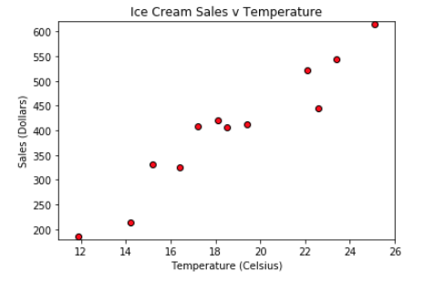

# Module 5 Class 1: Getting Started with Matplotlib and Visualizations

## Overview

This week, the students will be introduced to Matplotlib, a Python plotting library used to produce publication-quality data visualizations. Matplotlib has a set of features for creating and annotating charts that visualize data in a Data Series or DataFrame. Students will use Matplotlib to create line, bar, scatter, bubble, pie, and box-and-whisker charts, and also to make them visually compelling and informative by adding titles, axes labels, legends, and custom colors.  They’ll also be introduced to SciPy, a statistical Python package, and NumPy, a fundamental package for scientific computing, to perform summary statistics. 

The main focus of today's class is to get students comfortable with creating and annotating line, bar, pie, and scatter charts. 

## Learning Objectives

By the end of class, students will be able to:
 
* Create line, bar, pie, and scatter charts
* Add and modify chart features


- - -

## Instructor Notes

* The activities in this class will complement Lessons **5.0.1: Visualizing Ride-Sharing Data** through **5.1.9: Chart Extras**.  The students will benefit from these activities if they‘ve progressed through these lessons, which cover the following concepts, techniques, and tasks:  

* Create line, bar, pie, and scatter charts
* Add a title and x- and y-axes labels
* Add error bars and minor ticks

* A note on potential errors caused by the Matplotlib library:

  * The `%matplotlib notebook` magic command for the displaying the notebook on the backend is used in a number of activities. It not only makes a plot interactive, but it also allows it to be updated after the initial plot. If students encounter weirdness during the activities, check to see that they use this line before importing the plotting libraries.

  * On Windows the `%matplotlib notebook` command may have to be called twice to ensure that plots can be updated after the intiatl plot is made. 

    ```python
    %matplotlib notebook
    %matplotlib notebook
    ```

  * Ideally, students should update their Matplotlib to version 2.2 or later. A bug in earlier versions resizes plots after an image is exported with the `savefig()` method.

*  Encourage students to develop the habit of exploring the Matplotlib documentation. A large part of the process of developing plots with the library is reading [examples](http://Matplotlib.org/examples/index.html), so it is important for them to become accustomed to this workflow.


## Slides

[Matplotlib Day 1 slideshow](https://docs.google.com/presentation/d/1V7UE97mRa_yDPneKnVQ4igGwEE6jqfjRL94IntXA2C8/edit?usp=sharing)

## Student Resources

If students were unable to download today's [activity resources](https://2u-data-curriculum-team.s3.amazonaws.com/data-viz-online-lesson-plans/05-Lessons/5-1-Student_Resources.zip) from Canvas, please share them with the students. 

- - - 

## Before Class

### 0. Office Hours

| Activity Time: 0:30       |  Elapsed Time:     -0:30  |
|---------------------------|---------------------------|

<details>
  <summary><strong> 📣 0.1 Instructor Do: Office Hours</strong></summary>

* Before you begin class, hold office hours. Office hours should be driven by students. Encourage students to take full advantage of office hours by reminding them that this is their time to ask questions and get assistance from instructional staff as they learn new concepts.

* Expect that students may ask for assistance. For example: 

  * Further review on a particular subject
  * Debugging assistance
  * Help with computer issues
  * Guidance with a particular tool

</details>

- - - 

## During Class 

### 1. Getting Started

| Activity Time:       0:15 |  Elapsed Time:      0:15  |
|---------------------------|---------------------------|

<details>
  <summary><strong>📣 1.1 Instructor Do: Foundation Setting (0:10)</strong></summary>

* Welcome students to class.

* Direct students to post individual questions in the Zoom chat to be addressed by you or your TAs at the end of class.

* Open the slideshow and use slides 1-12 to walk through the foundation setting with your class.

* **Big Picture:** This is an opportunity to zoom out and see the big picture of where they are in the program. Take a moment to mention some real world examples that show the value of what they’re learning this week.

* **Program Pointers:** Talk through some of the key logistical things that will help students stay on track. This is an opportunity to speak to what students may need when they're at this particular point of the program. 

* **This Week - Matplotlib:** Talk through the key skills students will be learning this week. Let the students know that they will continue to use Jupyter Notebook and Pandas for cleaning and merging DataFrames as well creating new Series or DataFrames with `groupby()`. The primary focus of the Day 1 activities is to make sure students are comfortable using Matplotlib to create a variety of visualizations. On Day 2, the students will use their Pandas skills to clean, filter, and reshape DataFrames to create visualizations.   

* **This Week's Challenge:** For this week's challenge, let the students know that they'll be creating a summary DataFrame of the ride-sharing data by city type. Then, using Pandas and Matplotlib, they’ll create a multiple-line graph that shows the total weekly fares for each city type. 

* **Career Connection:** Let students know how they will be using the skills covered this week throughout their careers. It's important for them to know the "why". Give examples of when they may be used in work or when you have used those skills in your workplace. 

* **How to Succeed This Week:** Remind your students that they may have moments of frustration this week as they learn something complex. These moments are great for deepening their knowledge. Use the side material to outline some of the topics that they may find tricky in this module. Consider sharing something about your personal learning journey. It helps students to recognize that everyone starts somewhere and that they are not alone.

* **Today's Objectives:** Now, outline the concepts that will be covered in today's lesson. Remind students that they can find the relevant activity files in the Getting Ready for Class page in their course content.  

</details>

<details>
  <summary><strong>🎉  1.2 Everyone Do: Check-In (0:05)</strong></summary>

* Ask the class the following questions and call on students for answers:

    * **Q:** How are you feeling about your progress so far?

    * **A:** Let them know that we are starting to build their skillset. It’s also okay to feel overwhelmed as long as you don’t give up.

    * **Q:** How comfortable do you feel with this topic? 

    * **A:** Let's do "fist to five" together. If you are not feeling confident, hold up a fist (0). If you feel very confident, hold up an open hand (5).

</details>

<sub>[Having issues with this activity? Report a bug!](https://bit.ly/3r3UrCC)</sub>

- - - 


### 2. Legendary Temperature

| Activity Time:       0:25 |  Elapsed Time:      0:40  |
|---------------------------|---------------------------|


<details>
  <summary><strong>📣 2.1 Instructor Do: Introduction to Matplotlib (0:10)</strong></summary>

* Use slides 13-16 to remind students of basic Matplotlib concepts before going into a live demonstration.

* Open and run [01-Ins_BasicLineGraphs/exponential_chart.ipynb](Activities/01-Ins_BasicLineGraphs/Solved/exponential_chart.ipynb) in Jupyter Notebook to show students how Pyplot can be used to create an exponential line plot. Be sure to cover the following talking points:

  * For many of our Python activities, we will generate our data using the NumPy library. The NumPy library contains many built-in methods to generate and manipulate simple or complex data types.

  * `np.arange(start, end, step)` creates a NumPy array of numbers from `start` to `end`, where each number in the array is a `step` away from the next one.

  * A NumPy array is similar to a Python list, but they are not the same thing. A Python list can contain elements of various data types. In contrast, a NumPy array must contain only a single data type. This allows for faster computation and more efficient storage.

  * The `e_x` list is created using a list comprehension. List comprehensions allow lists to be created using mathematical formulas. For example, the one being used in this application takes values from the `x_axis` list one at a time, finds the exponent, and stores the response within a list.

    

  * Matplotlib allows users to generate plots by setting one list or array as the x-axis and another as the y-axis. It really is as simple as calling `plt.plot()`, passing those 2 lists through as parameters, and then calling `plt.show()` to print the chart to the screen.

  * Matplotlib handles the details of painting charts to the screen, but the programmer has full control over each stage of the drawing process if they really need it. By using `plt.xlabel()` and `plt.ylabel`, for example, users can easily add axis titles to their charts.

    

* Next, open and run [01-Ins_BasicLineGraphs/SinCos.ipynb](Activities/01-Ins_BasicLineGraphs/Solved/sin_cos.ipynb) in Jupyter Notebook to show students how Pyplot can be used to create a plot with multiple lines. Be sure to cover the following talking points:

  * `np.arange()`, `np.sin()`, and `np.cos()` are all being used to create the lists for the application's charts.

  * Charting multiple lines on the same chart is as simple as calling `plt.plot()` 2 times and providing Pyplot with different values.

    

  * While this plot is very simple, it introduces all of the major tools required to build much prettier plots in the future.

* Remind students that data visualizations provide more value than just aesthetics. Trends and potential human insights buried within complex datasets are often clearest when the data is visualized in some way.

* Send out the [exponential_chart.ipynb and SinCos.ipynb](Activities/01-Ins_BasicLineGraphs/Solved) files for students to refer to later.

* Ask the class the following questions and call on students for the answers:

    * **Q:** Where have we used this before?

    * **A:** We created line graphs in Lesson 5.1.3.

    * **Q:** How does this activity equip us for the Challenge?

    * **A:** We'll need to create line graphs in the Challenge.

    * **Q:** What can we do if we don't completely understand this?

    * **A:** We can refer to the lessons and reach out to the instructional team for help.

* Answer any questions before moving on to the student activity.

</details>

<details>
  <summary><strong>🎉 2.2 Everyone Do: Legendary Temperature (0:15)</strong></summary>

* In this exercise, the students will create two line plots, add labels to the x- and y-axes, and save the figure to a folder.  

* Make sure the students can download and open the [instructions](Activities/02-Evr_LegendaryTemperature/README.md) and the [legendary_temp_unsolved.ipynb](Activities/02-Evr_LegendaryTemperature/Unsolved/legendary_temp_unsolved.ipynb) file from the AWS link. 

* Have everyone open the [legendary_temp_unsolved.ipynb](Activities/02-Evr_LegendaryTemperature/Unsolved/legendary_temp_unsolved.ipynb) file and go over the instructions in each cell, and then let everyone work on the solution for 5-7 minutes. 

* When time is up, open the `legendary_temp_unsolved.ipynb` file and ask for volunteers to help you write the code for the solution.

* If there are no volunteers, open up the [legendary_temp.ipynb solution](Activities/02-Evr_LegendaryTemperature/Solved/legendary_temp.ipynb) and go through the code line by line with the class, answering whatever questions they may have. Cover the following talking points:

  * Just like in the previous activity we used NumPy to create an array for the x-axis. This time, we use `np.arange(1,13,1)` where the numbers start at 1 and end at 13, and the `step` is 1. 
  
  * For each line plot, we add the `x_axis` data for the x-axis, the `lows` array for the y-axis for the first line, and the `highs` array for the y-axis for the second line. 
  
  * The x- and y-axis labels are created with `xlabel()` and `ylabel()` functions. And the figure is saved using the `savefig()` method, where we pass in the folder and name of the image. 

    

* Answer any questions that the students have and then send out the [legendary_temp.ipynb solution](Activities/02-Evr_LegendaryTemperature/Solved/legendary_temp.ipynb) solution file for students to refer to later.

* Ask the class the following questions and call on students for the answers:

    * **Q:** How would you add a title to the line chart?

    * **A:** You would use the `plt.title()` function and pass in the name of the tile in parentheses.
    
    * **Q:** What can we do if we don't completely understand this?

    * **A:** Review Lessons 5.1.3 and 5.1.4 where we created and annotated line charts, and you can reach out to the instructional staff.

</details> 

<sub>[Having issues with this activity? Report a bug!](https://bit.ly/2WfyqT4)</sub>

- - - 

### 3. Bars Bar Chart

| Activity Time:       0:30 |  Elapsed Time:      1:10  |
|---------------------------|---------------------------|

<details>
  <summary><strong>📣 3.1 Instructor Do: Different Plots (0:05)</strong></summary>

* Use slides 17-20 while covering the following talking points:

  * Matplotlib provides a simple interface for producing more than just line plots.

  * The most common charts that students will generate are line charts, bar charts, pie charts, and scatter plots.

  * **Bar charts** are useful for comparing different entities to one another.

  * **Pie charts** are suitable for displaying parts of a whole—in particular, the amount each constituent contributes to the complete dataset.

  * **Scatter plots** are good for displaying where points fall with respect to 2 different factors.

  * It's important to choose the right plot for a given dataset; the wrong choice can make a graphic less readable or even make the data misleading.

  * Some data might lend itself to different plots; for example, some data can most clearly be displayed via bar or pie chart.

</details>

<details>
  <summary><strong>📣 3.2 Instructor Do: Bar Charts (0:05)</strong></summary>

* Use slides 21-24 while covering the following talking points: 

  * Bar charts are particularly useful when trying to visualize data that is counted or a single variable that is measured multiple times.

    * Data that comes from a single variable is called **univariate**.

    * For example, the amount of rainfall per month for a given location or the results of a poll containing a few different categories could be visualized effectively with a bar chart.

  * Bar charts are not very useful when comparing **bivariate** data, or data that compares 2 different variables.

    * For example, a dataset comparing the number of ice cream bars sold versus daily temperature would not be visualized well using a bar chart.

  * Ask the students to think of a few other examples of univariate datasets that would be visualized well with bar charts.

* Open the bar chart example within Jupyter Notebook: [03-Ins_BarCharts/bar_chart.ipynb](Activities/03-Ins_BarCharts/Solved/bar_chart.ipynb). Cover the following talking points:

  * When dealing with bar charts, it is necessary to provide the heights of each bar within an array.

  * The x-axis will also be an array whose length must be equal to the list of users.

  * Instead of using `plt.plot()`, bar charts are drawn using `plt.bar()`.

  * The `align` parameter for `plt.bar()` is centered in order to center the data on each tick.

    

  * An additional design challenge unique to bar charts is aligning the tick locations on the x-axis and providing textual labels rather than numeric ones.

  * The `tick_locations` list created within this application places a tick for each value in the `x_axis`.

    

  * `plt.xlim()` and `plt.ylim()` are set so that there is some space between the bars and the edges of the chart. This makes the chart look a little better.

* Send out the [03-Ins_BarCharts/bar_chart.ipynb](Activities/03-Ins_BarCharts/Solved/bar_chart.ipynb) file for students to refer to later.

* Ask the class the following questions and call on students for the answers:

    * **Q:** Where have we used this before?

    * **A:** The `plt.bar()` method was covered in Lesson 5.1.5. 

    * **Q:** How does this activity equip us for the Challenge?

    * **A:** We won't need to create bar charts in the Challenge, but being familiar with how to create a bar chart is good to know while performing exploratory data analysis. 

    * **Q:** What can we do if we don't completely understand this?

    * **A:** We can refer to the lessons and reach out to the instructional team for help.

* Answer any questions before moving on to the student activity.


</details>

<details>
  <summary><strong>✏️ 3.3 Student Do: Bars Bar Chart (0:15)</strong></summary>

* In this exercise, students will create a bar chart that visualizes the number of bars per household in a few cities, and add labels to the chart. You can use slides 25-27 for this activity. 

* Make sure the students can download and open the [instructions](Activities/04-Stu_PyBars/README.md) and the [py_bars_unsolved.ipynb](Activities/04-Stu_PyBars/Unsolved/py_bars_unsolved.ipynb) from the AWS link. 

* Go over the instructions in the README, then open up the [solution](Activities/04-Stu_PyBars/Solved/py_bars.ipynb) and show students the bar chart they'll be creating.

  

* Divide students into breakout groups of 3-5. They should work on the solution by themselves but can reach out to others in their group for tips.

* Let students know that they may be asked to share and walk through their work at the end of the activity.

</details>

<details>
  <summary><strong>⭐ 3.4 Review: Bars Bar Chart (0:05)</strong></summary>

* Once time is complete, ask for volunteers to share their solution. Remind them that it is perfectly alright if they didn't complete the activity. 

* To encourage participation, you can open the [py_bars_unsolved.ipynb](Activities/04-Stu_PyBars/Unsolved/py_bars_unsolved.ipynb) file and ask the students to help you write the code for each cell. 

* If there are no volunteers, open up the [py_bars solution](Activities/04-Stu_PyBars/Solved/py_bars.ipynb) file within the Jupyter Notebook and go through the code line by line with the class, answering whatever questions they may have.

* You may need to focus on how to set the ticks for the bar chart. With `tick_locations = [value for value in x_axis]`, you are creating an array that has the same length as the x-axis. And, with `plt.xticks(tick_locations, cities)`, you are placing the cities at the tick locations.  

* Explain that `plt.xlim()` is set to go from -0.75 to the length of the x-axis minus 0.25 so that there is a degree of space between the leftmost bar and the edge of the chart.

    

* Explain that the process of tweaking aesthetic parameters can be time-consuming. This is why we always want to save our Python code that we use to generate figures; a notebook or script makes recreating any plot a simple task.

* Send out the [py_bars solution](Activities/04-Stu_PyBars/Solved/py_bars.ipynb) solution file for students to refer to later.

* Ask the class the following questions and call on students for the answers:

    * **Q:** How would you change this chart to a horizontal bar chart?

    * **A:** You would use the `plt.barh()` function.
    
    * **Q:** What can we do if we don't completely understand this?

    * **A:** Review Lessons 5.1.5 and 5.1.6 where we created and annotated bar charts, and you can reach out to the instructional staff.

* Answer any questions before proceeding to the next activity.


</details>

<sub>[Having issues with this activity? Report a bug!](https://bit.ly/3niFTfU)</sub>

- - - 

### 4. Pies Pie Chart

| Activity Time:       0:25 |  Elapsed Time:      1:35  |
|---------------------------|---------------------------|

<details>
  <summary><strong>📣 4.1 Instructor Do: Pie Charts (0:05)</strong></summary>

* Use slides 28-31 while covering the following talking points: 

  * Pie charts are particularly useful when trying to visualize percentage, fractional, or proportional data.

    * Essentially, pie charts are great at visualizing "piece of the pie" data.

    * For example, a pie chart can effectively visualize the proportions of Democratic versus Republican versus independent voters.

    * Fewer categories mean a more effective and clear pie chart.

    * Pie charts are not effective with datasets that have more than about 10 categories. Similar to bar charts, pie charts are only effective describing univariate data.

    * When there are too many categories, pie charts become too busy and lose their effectiveness.

* Due to the overlap of functionality, bar charts can also be used to visualize the same data used to generate a pie chart.

  * However, pie charts can be far more dramatic and effective at demonstrating a fractional relationship.

  * When in doubt, it is always safer to visualize using a bar chart rather than overcrowding a pie chart.

* Ask the students to think of a few other examples of univariate datasets that would be visualized well with pie charts.

* Open the pie chart example: [05-Ins_PieCharts/pie_chart.ipynb](Activities/05-Ins_PieCharts/Solved/pie_chart.ipynb). Cover the following talking points:

  * The sizes of each wedge are passed into `plt.pie()` as an array. Lists containing the labels for each wedge and the colors for each wedge are also passed in.

  * The pie chart allows the user to choose a wedge to "explode," using the `explode` option. This will separate one wedge from the rest so that it is easier to examine.

  * Inside of the `plt.pie()` method, a parameter of `autopc="%1.1f%%"` is being passed. This will automatically convert the values passed in to percentages with one decimal place.

    

  * Matplotlib does not make pie charts circular by default; they will be ovals if the window the plot lives in is not a square. This is why `plt.axis("equal")` is being passed.

    

* Explain that there are additional configuration options available for improving the appearance of Matplotlib's pie charts, should students desire to look into them.

* Send out the [05-Ins_PieCharts/pie_chart.ipynb](Activities/05-Ins_PieCharts/Solved/pie_chart.ipynb) file for students to refer to later.

* Ask the class the following questions and call on students for the answers:

    * **Q:** Where have we used this before?

    * **A:** The `plt.pie()` method was covered in Lesson 5.1.8. 

    * **Q:** How does this activity equip us for the Challenge?

    * **A:** We won't need to create bar charts in the Challenge, but it’s good to be familiar with how to create a pie chart while performing exploratory data analysis.  

    * **Q:** What can we do if we don't completely understand this?

    * **A:** We can refer to the lesson plan and reach out to the instructional team for help.

* Answer any questions before moving on to the student activity.

</details>

<details>
  <summary><strong>✏️ 4.2 Student Do: Pies Pie Chart (0:15)</strong></summary>

* In this exercise, students will create a pie chart that visualizes the favorite pies of people in the United States. You may use slides 32-34 for this activity.  

* Make sure the students can download and open the [instructions](Activities/06-Stu_PyPies/README.md) and the [py_pie_unsolved.ipynb](Activities/06-Stu_PyPies/Unsolved/py_pie_unsolved.ipynb) files from the AWS link. 

* Go over the instructions in the README, then open up the [solution](Activities/06-Stu_PyPies/Solved/py_pie.ipynb) and show the students the pie chart they'll be creating.

  

* Divide students into breakout groups of 3-5. They should work on the solution by themselves but can reach out to others in their group for tips.

* Let students know that they may be asked to share and walk through their work at the end of the activity.


</details>

<details>
  <summary><strong>⭐ 4.3 Review: Pies Pie Chart (0:05)</strong></summary>

* Once time is complete, ask for volunteers to share their solution. Remind them that it is perfectly alright if they didn't complete the activity. 

* To encourage participation, you can open the [py_pie_unsolved.ipynb](Activities/06-Stu_PyPies/Unsolved/py_pie_unsolved.ipynb) file and ask the students to help you write the code for each cell. 

* If there are no volunteers, open up the [py_pie.ipynb solution](Activities/06-Stu_PyPies/Solved/py_pie.ipynb) file within the Jupyter Notebook and go through the code line by line with the class, answering whatever questions they may have. Cover the following talking points:

  * Knowing what colors are available is one of the things that makes this activity a little challenging. Students can find a list of available colors to peruse [here](https://matplotlib.org/users/colors.html).

  * It’s easy to make pie charts because editing the chart only really requires editing the values. Otherwise, the styling and aesthetics are fairly uniform across charts.

    

* Send out the [py_bars solution](Activities/06-Stu_PyPies/Solved/py_pie.ipynb) solution file for students to refer to later.

* Ask the class the following questions and call on students for the answers:
    
    * **Q:** What can we do if we don't completely understand this?

    * **A:** Review Lessons 5.1.5 and 5.1.6 where we created and annotated bar charts, and you can reach out to the instructional staff.

* Answer any questions before proceeding to the next activity.

</details>

<sub>[Having issues with this activity? Report a bug!](https://bit.ly/2KtQdTW)</sub>

- - - 

### 5. Scatter Py

| Activity Time:       0:20 |  Elapsed Time:      1:55  |
|---------------------------|---------------------------|

<details>
  <summary><strong>📣 5.1 Instructor Do: Scatter Plots (0:05)</strong></summary>

* Use slides 35-42 to while covering the following talking points:

  * Scatter plots are extremely useful when visualizing **bivariate** data, or data that relates 2 variables.

    * Any data that we can plot on the x- and y-axis from 2 lists is considered bivariate data.

    * We can describe bivariate data as something versus something else.

    * For example, if we were to plot the amount of ice cream sold per day versus daily temperature, this bivariate data would be best visualized using a scatter plot.

  * Scatter plots are one of the cleanest and most effective charts to use on large datasets (datasets that have 500 values or more).

  * Scatter plots are frequently used to visualize clusters in a dataset.

  * Scatter plots are not great for visualizing continuous measurements.

    * The most common continuous data is data measured over time, or **time series** data.

  * When data is continuous, we often want to be able to interpolate between measurements. In this case, scatter plots may not be as effective as a line plot.

    * This is especially true if the dataset is small: the smaller the dataset, the more likely it is that the audience will want to read between the data points.

  * In most cases, datasets will be large enough to effectively use scatter plots.

* Finally, open the scatter plot example: [07-Ins_ScatterPlots/scatter_plot.ipynb](Activities/07-Ins_ScatterPlots/Solved/scatter_plot.ipynb). Cover the following talking points:

  * This plot uses random data so the class can avoid cluttering the example with Pandas cleanup; later activities will provide more realistic context.

  * Generating scatter plots demands the simplest set of methods of all the charts we have covered so far. Simply take in 2 sets of data and pass them into `plt.scatter()`.

  * The code can change the size of each dot by passing the `s=<LIST>` parameter. In this case, the values stored within `x_axis` will determine the size of a dot.

    
  
  * As we adjust the x- and y-limits and the plot will change as the cells are executed. 

    

* Send out the [07-Ins_ScatterPlots/scatter_plot.ipynb](Activities/07-Ins_ScatterPlots/Solved/scatter_plot.ipynb) file for students to refer to later.

* Ask the class the following questions and call on students for the answers:

    * **Q:** Where have we used this before?

    * **A:** The `plt.scatter()` method was covered in Lesson 5.1.7. 

    * **Q:** How does this activity equip us for the Challenge?

    * **A:** We won't need to create scatter plots in the Challenge, but it’s good to be familiar with how to create a scatter plot when performing exploratory data analysis.  

    * **Q:** What can we do if we don't completely understand this?

    * **A:** We can refer to the lesson plan and reach out to the instructional team for help.

* Answer any questions before moving on to the student activity.

</details>

<details>
  <summary><strong>🎉 5.2 Everyone Do: Scatter Py (0:15)</strong></summary>

* In this exercise, students will create a scatter plot that visualizes the relationship between ice cream sales and the increase in temperature.  You may use slides 39-41 for this activity.  

* Make sure the students can download and open the [instructions](Activities/08-Evr_ScatterPy/README.md) and the [ice_cream_sales_unsolved.ipynb](Activities/08-Evr_ScatterPy/Unsolved/ice_cream_sales_unsolved.ipynb) files from the AWS link. 

* Review the instructions with the students, then let the students work on their solution for 7-10 minutes.

* When time is up, open the [ice_cream_sales_unsolved.ipynb](Activities/08-Evr_ScatterPy/Unsolved/ice_cream_sales_unsolved.ipynb) file and ask for volunteers to help you write the code for each cell.

* If there are no volunteers, begin adding the code for each cell and make sure to point out the following:

  * In order to make the scatter plot easier to read, we customize the color and border of the markers using the `facecolors` and `edgecolors` arguments.

  * If students are curious about the different color and shape options, they can look at `matplotlib.pyplot` documentation.

  * With scatter plot data, values will often be tightly clustered or there will be large ranges of white space between values. It is a good idea to set the `plt.xlim()` and `plt.ylim()` functions to ensure our figures are clear and readable.

    

* Answer any questions before ending class.

</details>

<sub>[Having issues with this activity? Report a bug!](https://bit.ly/2LBk6C9)</sub>

- - - 

### 6. Ending Class 

| Activity Time:       0:05 |  Elapsed Time:      2:00  |
|---------------------------|---------------------------|

<details>
  <summary><strong>📣  6.1 Instructor Do: Review </strong></summary>

* Before ending class, review the skills that were covered today and mention where they can be found in the module. 
  * Creating line charts was covered in **Lessons 5.1.3**.
  * Annotating charts was covered in **Lesson 5.1.4**.
  * Creating bar charts was covered in **Lesson 5.1.5**.
  * Creating scatter charts was covered in **Lesson 5.1.7**.
  * Creating pie charts was covered in **Lesson 5.1.8**.
  * Adding color, formatting text, and adding minor ticks was covered in **Lesson 5.1.9**.

* Answer any questions the students may have.

</details>

<sub>[Having issues with this section? Report a bug!](https://bit.ly/3acPEZh)</sub>

---

© 2021 Trilogy Education Services, LLC, a 2U, Inc. brand.  Confidential and Proprietary.  All Rights Reserved.
