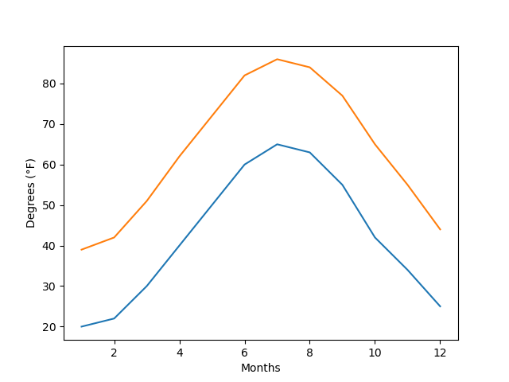

# Legendary Temperature

* In this activity you will expand upon your temperature plots to add a legend.

## Instructions

* Modify the New Jersey temperature line charts from earlier so that they match the image provided.

* Once the plot has been created, look through the [Matplotlib documentation](https://matplotlib.org/2.0.2/index.html) to see what additional formatting could be added to the chart.

---

© 2021 Trilogy Education Services, LLC, a 2U, Inc. brand.  Confidential and Proprietary.  All Rights Reserved.
